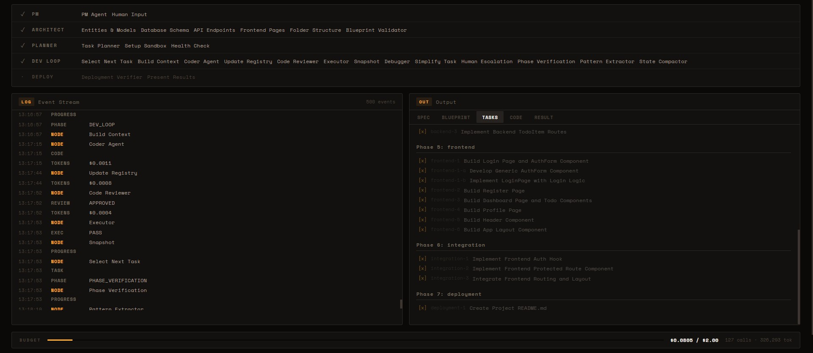
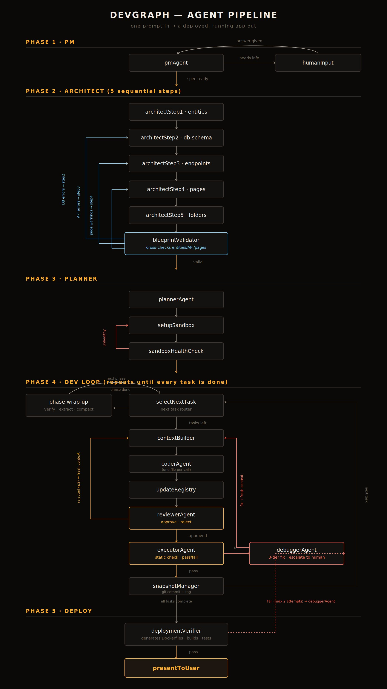

# DevGraph

**An autonomous multi-agent system that turns a single sentence into a deployed, running full-stack application.**

You describe what you want. A pipeline of specialized agents — planning, architecture, code generation, review, and self-repair — hands work off to each other step by step until your idea is a working app with its own database, backend, frontend, and Docker deployment.

---

## Demo




---

## Why this exists

Most "AI app builders" are a single LLM call wrapped in a chat UI — impressive for a to-do list, and unreliable the moment the app has more than one moving part. DevGraph is built around one core idea instead:

> **Let the LLM do the creative work. Let deterministic code do the structural work.**

Concretely: an LLM decides *what* your app's models, routes, and pages should look like. But things that need to be byte-exact — Dockerfiles, `docker-compose.yml`, database migrations, wiring every route into `index.js`, wiring every page into `App.jsx` — are generated by **plain, deterministic JavaScript that reads the actual files on disk**, never by asking an LLM to remember what it wrote three calls ago. This one design decision removes an entire category of bugs (hallucinated imports, forgotten routes, wrong ports) before they can happen.

---

## Architecture




The pipeline is a [LangGraph](https://github.com/langchain-ai/langgraphjs) state machine with 26 nodes across 5 phases:

| Phase | What happens |
|---|---|
| **PM** | Turns a vague request into a formal spec. Asks clarifying questions through the dashboard if needed. |
| **Architect** | 5 sequential steps design entities, DB schema, API endpoints, frontend pages, and folder structure — then a validator cross-checks all of it for contradictions (e.g. an endpoint referencing a table that doesn't exist) and loops back to fix them *before* any code is written. |
| **Planner** | Breaks the validated blueprint into an ordered task list, spins up an isolated Docker sandbox (Postgres/Mongo + backend + frontend containers). |
| **Dev Loop** | The core loop: pick a task → build context → write the file → review it → statically test it → snapshot to git. Failures get one of three responses depending on severity: automatic retry with fresh context, a tiered debugger (up to 3 fix attempts + a git rollback), or — as a last resort — a human decision surfaced through the dashboard. |
| **Deploy** | Generates Dockerfiles and `docker-compose.yml` deterministically from what's actually on disk, builds the containers, and hits real endpoints to confirm the app actually runs before calling it done. |

### A few specific design choices worth knowing about
- **One file per LLM call in the coder step** — prevents response truncation on larger files and keeps each generation focused.
- **A shared naming-convention contract** — the architect's first step generates a naming map (PascalCase entities, snake_case DB fields, kebab-case routes) that every later step is constrained to follow, so the frontend and backend never disagree on what something is called.
- **A file export registry** — every written file gets indexed with what it exports, so later tasks get real context about existing code instead of the LLM guessing or re-reading entire files.
- **Static execution checks before real runtime checks** — the executor validates syntax, import resolution, and export names without spinning up a full server, catching most wiring bugs cheaply before anything more expensive runs.

---

## Live dashboard

A React + Zustand dashboard connects over WebSocket and streams every pipeline event live: which node is active, review verdicts, token cost as it accrues, and any point where the pipeline needs your input.

<!--  -->

---

## Tech stack

**Orchestration:** LangGraph (JS) · Google Gemini
**Backend:** Node.js · Express · WebSocket (`ws`) · Redis (checkpointing, with automatic in-memory fallback)
**Dashboard:** React · Vite · Zustand
**Sandbox:** Docker (Postgres/MongoDB + backend + frontend containers per project, fully isolated from the host)

---

## Project structure

```
devgraph/
├── src/
│   ├── agents/          # pmAgent, architectAgent, plannerAgent, coderAgent,
│   │                     reviewerAgent, executorAgent, debuggerAgent
│   ├── nodes/            # setupSandbox, contextBuilder, updateRegistry,
│   │                     phaseVerification, assembleEntryPoints,
│   │                     deploymentVerifier, and more
│   ├── config/           # graph.js (the LangGraph wiring), state.js
│   └── utils/            # sandboxManager.js (Docker), gemini.js (LLM calls
│                          + JSON repair), tokenTracker.js
├── server/
│   ├── index.js          # Express + WebSocket entry point
│   ├── routes/           # REST API (create/list/resume/cancel projects)
│   ├── ws/                # WebSocket event handler
│   └── services/          # bridges the LangGraph pipeline to the dashboard
├── dashboard/             # React + Vite frontend
├── tests/                 # mocked, no-API-key-needed test suites
└── sandboxes/              # generated apps land here, one folder per run
```

---

## Getting started

### Requirements
- **Node.js 20+**
- **Docker Desktop** (running) — every generated project gets its own isolated containers
- **A Gemini API key** — free tier works fine. Get one at [aistudio.google.com/apikey](https://aistudio.google.com/apikey)

### 1. Clone and install
```bash
git clone https://github.com/Vaibhav-Pandey7/devgraph.git
cd devgraph
npm install

cd dashboard
npm install
cd ..
```

### 2. Configure environment
Create `.env` in the project root:
```dotenv
GEMINI_API_KEY=your_key_here
GEMINI_MODEL=gemini-2.5-flash
REDIS_URL=redis://localhost:6379
SERVER_PORT=3000
FRONTEND_URL=http://localhost:5173
TOKEN_BUDGET=2.0
```

Create `dashboard/.env`:
```dotenv
VITE_API_URL=http://localhost:3000/api
VITE_WS_URL=ws://localhost:3000
```

### 3. Start Redis
```bash
docker run -d --name devgraph-redis -p 6379:6379 redis:7-alpine
```
*(Optional — if Redis isn't reachable, DevGraph automatically falls back to an in-memory checkpointer. You lose crash-recovery across restarts, but everything else still works.)*

### 4. Run it
```bash
npm run dev
```
This starts the backend (`:3000`) and dashboard (`:5173`) together. Open `http://localhost:5173`, type what you want built, and watch it happen.

### 5. Run your generated app
Once a project finishes, DevGraph prints exact instructions, but generally:
```bash
cd sandboxes/sandbox-<id>
docker compose up
```

---

## Cost

Every agent call is tracked and totaled live. A typical small app (a handful of pages, one database table) runs **$0.01–$0.10** in Gemini API cost depending on how many review/retry cycles it takes. The dashboard shows running cost against a configurable budget ceiling (`TOKEN_BUDGET`) so a run can't spiral silently.

---

## Known limitations

Being upfront about where this is genuinely still rough, rather than pretending it's finished:

- **Deployment can occasionally need a manual nudge.** The dev loop's self-healing is strong for application code, but infrastructure-level failures (a broken Dockerfile, a bad `docker-compose.yml`) don't currently route through the same repair path as code failures — the debugger diagnoses them correctly but has no task-based mechanism to act on the fix yet.
- **Windows-specific quirks.** Developed and tested primarily on Windows + Docker Desktop; a few shell-quoting and path issues were found and fixed along the way, but if you hit something odd on Linux/Mac, it likely hasn't been exercised there yet.
- **No auth or rate-limiting on the dashboard/API.** This is built to run locally against your own API key, not as a multi-tenant hosted service.
- **Large, unusual requirements can hit the token budget or graph recursion limit** before finishing, particularly if a planner-generated task turns out to be structurally unsolvable (e.g. a task with no concrete file to produce) and keeps getting split into smaller versions of itself.

---
