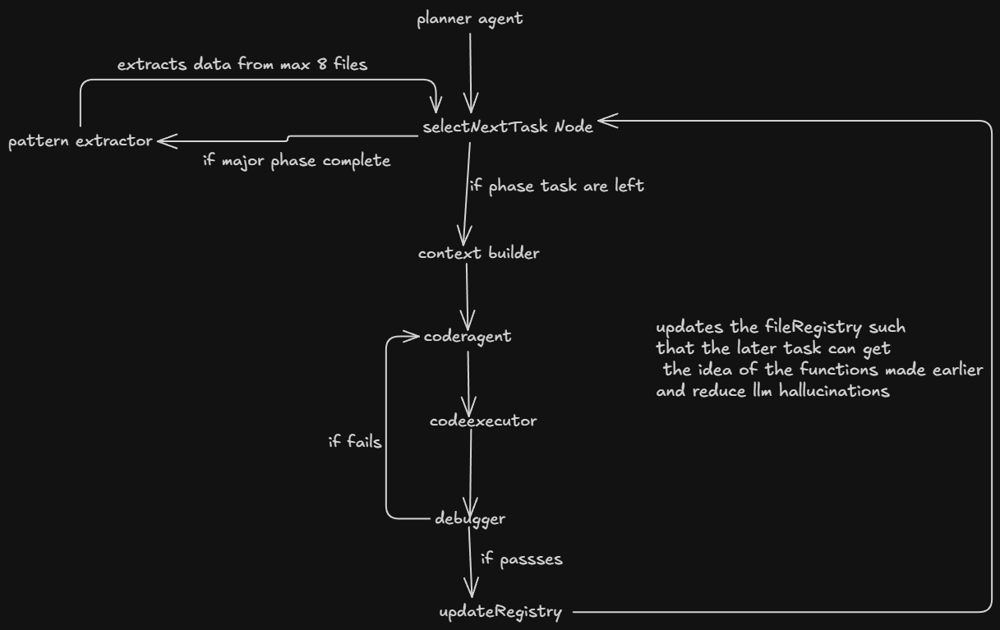

# DevGraph: Autonomous Multi-Agent AI Development System  
  
## DevLoop Pipeline

### How the Loop Works:
* **selectNextTask:** The Foreman acts as the loop manager, pulling tasks from the queue.
* **contextBuilder:** Injects specific file templates and schemas to prevent context bloat.
* **coderAgent:** Writes the code while adhering to strict rules.
* **reviewerAgent:** A self-contained debugger that forces the Coder to fix its own errors.
* **updateRegistry:** Updates the state so later tasks know exactly what functions were exported, drastically reducing LLM hallucination and import hell!
